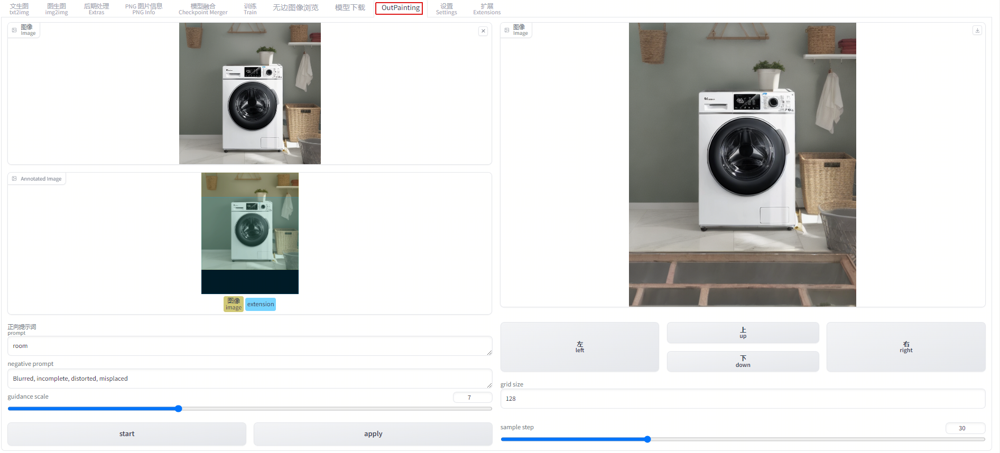

# sd_webui_outpaint

Extension for [webui](https://github.com/AUTOMATIC1111/stable-diffusion-webui). This is a outpainting to image demo using diffusers and the [gradio library](https://github.com/gradio-app/gradio). 




Find the UI for talking face generation in the Extras tab after installing the extension.

Finally, these weights should be organized in `models` as follows:
```
./models/
├── musetalk
│   └── musetalk.json
│   └── pytorch_model.bin
├── dwpose
│   └── dw-ll_ucoco_384.pth
├── face-parse-bisent
│   ├── 79999_iter.pth
│   └── resnet18-5c106cde.pth
├── sd-vae-ft-mse
│   ├── config.json
│   └── diffusion_pytorch_model.bin
└── whisper
    └── tiny.pt
```

# Installation

Install from webui's Extensions tab.

# Credits

* Musetalk library that does all the work: https://github.com/TMElyralab/MuseTalk
